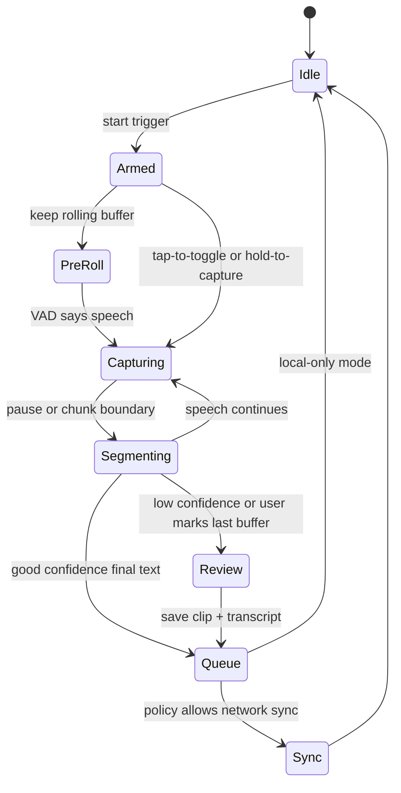
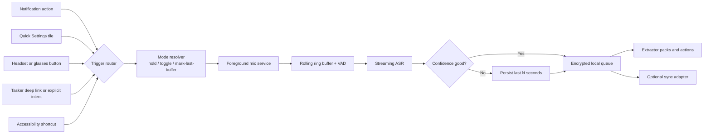
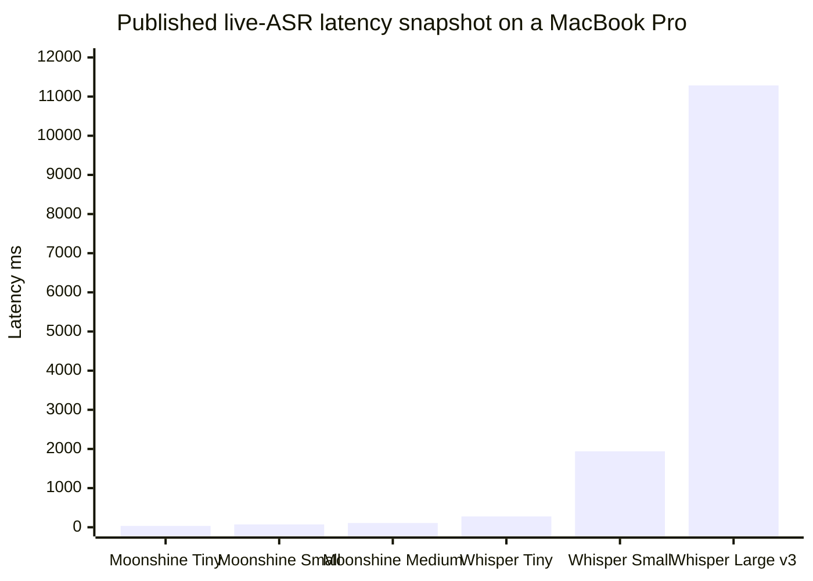

# Phone App Memory Capture Roadmap Research Report

## Executive summary

Your fork already contains a **real Android/Flutter application**, not just backend or iOS code. The `app/` tree includes Flutter app code, a native Android manifest, a Kotlin BLE package under `app/android/app/src/main/kotlin/com/friend/ios`, Pigeon bridge definitions, a companion-device service, a foreground BLE service, a GATT manager, and a native batch audio writer. In plain terms: you do **not** need to start the phone app from scratch. You already have a workable base for BLE device presence, background connection management, and offline batch audio capture. citeturn20view0turn19view0turn7view1turn7view2turn21view0turn22view1turn23view0turn6view1turn6view2

The main gap is not “can the phone app connect to hardware?” It clearly can. The real gap is architectural: your app idea is **trigger-first**, **local-first**, **confidence-aware**, and meant to act like a personal memory layer. Omi’s public model is broader and more cloud-oriented: developer webhooks, raw audio streaming to backends, daily summaries, memories, conversations, and action items, all tied to a hosted infrastructure and app marketplace. That gives you useful primitives, but it does *not* give you the exact ideology you want out of the box. citeturn24view0turn24view2turn24view3turn37view0turn37view1

My strongest recommendation is this: **do P0 on the phone only**, with no custom hardware, and ship the first useful version around **easy activation + local queue + low-confidence clip retention**. Start with notification action, Quick Settings tile, deep link / Tasker entry, and headset media-button detection. Keep accessibility volume-key triggering as a later, likely sideload or enterprise-only feature because of both platform awkwardness and Google Play policy risk. citeturn10search0turn10search1turn9search2turn9search12turn9search6turn25search0turn25search2turn25search16

For speech, the best **P0 default** is Moonshine on Android if you want one focused, low-latency, embeddable stack with published mobile-friendly benchmarks and Maven distribution. The best **parallel fallback / hedge** is sherpa-onnx, because it gives you a wider toolkit surface for VAD, keyword spotting, wake phrases, Android demos, and model flexibility. Use whisper.cpp later as a *batch re-checker* for saved low-confidence audio, not as your first live stack. Treat FUTO Voice Input and notune’s Android Transcribe App as **reference apps** and UX benchmarks more than drop-in SDKs. citeturn33search0turn31view0turn31view1turn15search4turn31view2turn30search0turn31view3turn13view1

On privacy, copy the *shape* of robust local systems, not Omi’s hosted default. Keep the ring buffer in RAM; keep full raw audio only when the user marks it or the ASR is uncertain; encrypt queued files at rest; sync through a thin adapter into your memory backend. Your fork already contains a native batch writer that writes framed local files for later upload, which is useful evidence that this pattern fits your current codebase. citeturn22view1turn24view0turn24view1turn36search0turn36search3turn36search15

On future hardware, ESP32-C3 is fine as a **tiny trigger peripheral**; ESP32-S3 is the better path for any future audio front-end or tiny on-device signal work because it adds stronger compute and vector support. *Brain-activity-triggered activation* is interesting but it is *not* a near-term product path for this phone app. EMG silent-speech work is promising for tiny command sets; ear-EEG is feasible in research; both remain fragile under real-world placement and motion. citeturn17search4turn17search1turn17search5turn17search7turn17search10turn17search6turn17search2

## Confirmed codebase inventory

The public fork at `sriharshaguthikonda/omi` is clearly a fork of `BasedHardware/omi`, is MIT-licensed, and includes an `app/` subtree with both Flutter code and Android native code. The `lib/` folder contains Flutter subdirectories such as `backend`, `providers`, `services`, `pages`, `mobile`, and `ui`, and also includes `main.dart` and `pigeon_interfaces.dart`. The Android side includes native services declared in the manifest and a Kotlin package full of BLE-specific classes. So the answer to “does my fork even have Android app code?” is **yes**. citeturn35view0turn20view0turn19view0turn38view0

### What is already present and worth inspecting first

| Path | What it appears to do | Why it matters for issue #3 |
|---|---|---|
| `app/android/app/src/main/AndroidManifest.xml` | Declares Bluetooth, microphone, foreground-service, companion-device and calendar permissions; registers `BleCompanionService`, `OmiBleForegroundService`, Flutter background services, and `NotificationOnKillService`. citeturn7view0turn7view1turn7view2turn7view3 | This is the truth source for what background patterns the app is already trying to use. |
| `app/android/app/src/main/kotlin/com/friend/ios/BleCompanionService.kt` | `CompanionDeviceService` that starts BLE foreground management when the OS reports device appearance, including newer `DevicePresenceEvent` handling. citeturn6view1 | This is already the seed for glasses / wearable presence-triggered activation. |
| `app/android/app/src/main/kotlin/com/friend/ios/OmiBleForegroundService.kt` | Single owner of BLE connection lifecycle; handles connect, bond, MTU, retry, reconnect, notification updates, and lazy creation of background audio streamer and batch writer. citeturn6view2 | This is the core native service you can extend for “armed / listening / batch capture” modes. |
| `app/android/app/src/main/kotlin/com/friend/ios/OmiBleManager.kt` | Pure GATT wrapper for scanning, characteristic ops, command queue, RSSI history, and bond handling. It explicitly says connection lifecycle belongs to `OmiBleForegroundService`. citeturn23view0 | This separation is good. Keep it. Add new triggers above it, not inside it. |
| `app/android/app/src/main/kotlin/com/friend/ios/BleHostApiImpl.kt` | Pigeon host implementation routing Flutter commands to native scan / manage / bond / characteristic calls; also handles companion association and Bluetooth enable flow. citeturn22view0 | This is the clean bridge point from Flutter UI into native BLE control. |
| `app/android/app/src/main/kotlin/com/friend/ios/OmiBatchAudioWriter.kt` | Native offline sink for BLE audio. Writes length-prefixed `.bin` files for later sync, rotates on size/time, finalises on gaps, fsyncs, and avoids ingesting half-written files. citeturn22view1 | This is extremely relevant to your low-confidence audio retention plan. |
| `app/android/app/src/main/kotlin/com/friend/ios/OmiBackgroundAudioStreamer.kt` | File is present in the tree and is referenced by the foreground service and batch writer comments as the native streaming path when batch mode is off. citeturn19view0turn6view2turn22view1 | Inspect this before designing any new live transcript hook. It may already solve half the problem. |
| `app/android/app/src/main/kotlin/com/friend/ios/OmiCompanionManager.kt` | File is present in the tree and is used by `BleHostApiImpl` to request companion association and get MAC addresses. citeturn19view0turn22view0 | This is the place to study if you want reliable glasses / headset BLE association. |
| `app/lib/pigeon_interfaces.dart` | Defines BLE host APIs, diagnostics types, companion-association methods, and a Flutter callback `onBatchRecordingFinalized`. citeturn21view0 | This is the schema contract you should extend instead of adding ad hoc platform channels. |
| `app/lib/` directory structure | Contains `backend`, `providers`, `services`, `pages`, `mobile`, and `main.dart`. citeturn20view0 | This confirms there is already room for a proper feature module on the Flutter side. |

### What this means in practice

The fork already has three patterns you can directly build on:

First, it has **native BLE lifecycle ownership**, which is the right shape for background wearables and avoids stuffing connection logic into Flutter. Second, it has a **typed Flutter↔native bridge** through Pigeon for BLE and diagnostics. Third, it has a **native batch audio path** that already thinks in terms of local files, finalisation, and later upload. Those three pieces are exactly the base you need for a memory-capture phone app. citeturn6view2turn22view0turn22view1turn21view0

### Quick inspection order

If you are updating GitHub issue #3, the right file-inspection order is: `AndroidManifest.xml` → `OmiBleForegroundService.kt` → `OmiBleManager.kt` → `BleHostApiImpl.kt` → `OmiBatchAudioWriter.kt` → `OmiBackgroundAudioStreamer.kt` → `OmiCompanionManager.kt` → `pigeon_interfaces.dart`. That order moves from platform truth, to connection ownership, to Flutter bridge, to audio persistence, to trigger and companion extensibility. citeturn7view0turn6view2turn23view0turn22view0turn22view1turn21view0turn19view0

## Architecture gaps versus Omi

Omi’s public developer model is built around hosted nouns and hosted hooks: memories, conversations, action items, integration webhooks, real-time transcript processors, real-time raw audio streaming, and daily summaries. That is useful, but your app idea is more sharply scoped: “capture fast, stay local, trigger easily, keep uncertainty, and integrate later.” So the gaps are not basic app plumbing; the gaps are **local runtime architecture**, **trigger orchestration**, and **confidence-aware storage**. citeturn24view3turn37view0turn37view1turn24view0

### Gap analysis and implementation options

| Capability | Omi baseline | What is missing for your app ideology | Concrete implementation options | Trade-off | Effort |
|---|---|---|---|---|---|
| Plugin model | Omi supports prompt apps and server-backed integration apps; Screenpipe has local “pipes” as scheduled markdown-defined agents. citeturn8search0turn8search3turn29view0 | You need **local-first extractor packs**, not just cloud webhooks. | **Option A:** local JSON/YAML extractor registry in Flutter/Kotlin. **Option B:** isolate- or WASM-based plugin sandbox. **Option C:** webhook plugin parity with Omi for later. | A is fastest and safest. B is cleaner long-term. C is easy to ship but weaker on privacy. | A = **S**, B = **L**, C = **M** |
| Live transcript hooks | Omi can send transcript segments to webhooks and stream raw audio bytes. citeturn37view0turn37view1 | You need an **in-process event bus** so local features react without a backend round-trip. | **Option A:** append-only local segment stream in Room. **Option B:** Kotlin `SharedFlow` / Dart stream bridge. **Option C:** outbound webhook mirror as optional plugin output. | A+B together are best. Webhook-only is *too cloud-shaped* for your use case. | **M** |
| Audio streaming | Omi has raw PCM webhook streaming and your fork already has native foreground streaming plus batch writing. citeturn37view1turn6view2turn22view1 | You need **ring-buffered local streaming** with mark-last-buffer and low-confidence salvage. | **Option A:** keep the audio bus in native Kotlin, expose only segments and marks. **Option B:** mirror PCM into Flutter. **Option C:** spin a localhost service. | A is the right answer. B increases jank and battery cost. C is over-engineered for P0. | **M** |
| Extractor packs | Omi apps can process memories, transcripts, raw audio, and day summaries. Screenpipe pipes can schedule local AI actions. citeturn37view0turn29view0 | You need **reusable packs** such as “action items”, “contact follow-up”, “study notes”, “PLAB reflections”, “shopping”, “idea inbox”. | **Option A:** rule packs with deterministic regex / intent / entity extraction. **Option B:** local LLM-assisted extractor packs. **Option C:** hybrid where rules fire first and LLM refines. | Start with A for speed and trust; move to C later. | A = **S**, C = **M** |
| Action queue | Omi exposes action items in its developer API, but your app needs a **durable local outbox** before it talks to anything external. citeturn24view3turn22view1turn36search0turn36search3 | There is no clear local-first action queue in the public model. | **Option A:** Room tables + WorkManager sync jobs. **Option B:** full event-sourced log. | A is enough. B is elegant but *not* a P0 need. | **M** |
| Daily digest | Omi can generate day summaries and deliver them to webhooks. citeturn37view0 | You need a **daily review inbox**, not just push-out summary. | **Option A:** nightly on-device digest over stored segments. **Option B:** optional backend digest. **Option C:** Screenpipe-style scheduled “review pipe”. | A gives privacy and habit-building. B helps if model cost is not a problem. | A = **M**, B = **M** |
| Dev / debug mode | Omi’s developer mode can stream audio bytes to a URL. citeturn37view1 | You need a **clear debug surface** for triggers, VAD, confidence, ring-buffer marks, and queue states. | **Option A:** hidden developer screen. **Option B:** replay harness from saved clips. **Option C:** one-tap bug bundle export. | All three are worth doing; A first. | A = **S**, B = **M**, C = **M** |

### The architectural answer I would choose

For issue #3, I would define the phone app around four internal buses:

**Trigger bus** → **capture state machine** → **segment / confidence bus** → **local action queue**.  
Everything else becomes a plug-in around those buses: notifications, Quick Settings, headset buttons, glasses BLE triggers, extractors, daily review, sync adapters, and future hardware. This is the cleanest way to keep the app extensible without copying Omi’s cloud-first view of the world. Omi already has the BLE and batch-capture pieces; you need to add the **trigger router** and the **local outbox**. citeturn6view2turn22view1turn21view0turn37view0turn29view0turn36search0turn36search3

This state machine is the right fit for your “thoughts running like a river” use case because it separates **arming** from **capturing**, and separates **capture** from **retention**. That gives you far more control than a single big red record button. citeturn9search4turn9search18turn22view1

## Activation triggers and Android constraints

For a public Android app, the trigger ranking should be:

**notification action** → **Quick Settings tile** → **Tasker / deep link / explicit intent** → **headset media button** → **glasses or BLE custom trigger** → accessibility-based volume-key path only if you accept higher review risk or a non-Play distribution. The reason is simple: this ordering best matches Android’s supported entry points and avoids fragile or policy-sensitive behaviour early on. citeturn10search0turn10search1turn11search0turn11search1turn9search2turn25search0turn25search2turn25search16

### Trigger comparison

| Trigger | Android APIs / mechanism | Permissions / policy | Reliability | Main edge cases | Recommendation |
|---|---|---|---|---|---|
| Notification action | Foreground service + notification action `PendingIntent`; microphone FGS must be declared correctly on Android 14+. citeturn9search0turn9search4turn25search2turn25search16 | Needs microphone permission, foreground-service declarations, and user-visible notification. | **High** | User may dismiss notification channel or deny POST_NOTIFICATIONS on newer Android; background mic start still needs care. | **P0 core** |
| Quick Settings tile | `TileService`; user adds tile manually. Android documents it as the right surface for quick actions. citeturn10search0turn10search1 | No special dangerous permission by itself; still tied to mic / FGS on actual capture. | **High** once added | User has to add the tile; tile lifecycle is odd; activity-launch rules changed on newer Android. | **P0 core** |
| Headset play/pause / media button | Active `MediaSession` with `onMediaButtonEvent()` or Media3 session handling. citeturn9search2turn9search8turn9search12 | No dangerous permission, but you only get events that the device and system actually route to media. | **Medium** | Many headsets route some buttons to voice assistants, HFP, or vendor apps instead of your session. | **P0 experiment**, not sole trigger |
| Headset mapping wizard | Use temporary active session and log which `KeyEvent`s arrive; let the user choose tap / long press semantics. Supported as an app pattern, not a special Android API. citeturn9search2turn9search12 | Same as above. | **Medium** | Different headsets expose different buttons; some give nothing useful. | **P0/P1** |
| Volume-key accessibility shortcut | Android accessibility shortcut can be tied to a service using both volume keys, but this sits in AccessibilityService territory. Android documents the shortcut, and Google Play tightly limits Accessibility API use. citeturn9search3turn9search6turn25search0turn25search17 | **High policy risk** if positioned badly for general automation. Requires prominent disclosure and a narrow purpose. | **Medium** | Review risk, user friction, OEM quirks, conflict with actual accessibility use. | *Avoid for public P0* |
| Tasker / automation intent | Explicit exported receiver or deep link / app link. Android recommends explicit intents for security. citeturn11search0turn11search1turn11search11turn11search13 | No unusual policy risk if locked down properly. | **High** | Need careful component export rules and auth token / signature check if external apps can trigger capture. | **P0 core** |
| Glasses button over media / HID | If the glasses expose standard media keys, reuse `MediaSession`; if they expose BLE presence or custom GATT, use Companion Device Manager and custom characteristics. citeturn26search0turn26search3turn26search9turn27view0 | BLE permissions + companion permissions if you use CDM path. | **Medium** | Vendor-specific behaviour; some “smart glasses” act just like headsets, others do not. | **P1/P2** |
| Ring-buffer mark-last-buffer | Local in-app action: on trigger, save the last N seconds from the rolling PCM / Opus buffer. This is your design choice, not a platform feature. It pairs well with native batch writing and foreground-service capture. citeturn22view1turn9search14turn9search18 | Same mic / FGS rules as capture. | **High** | Buffer size and memory pressure; must avoid saving everything all the time. | **P0 must-have** |

### Recommended trigger-to-action flow

This is the right mental model for your app because the trigger does *not* decide storage policy directly. The trigger only opens or marks the capture path. Retention happens later, after the app has signal about confidence, context, and user preference. citeturn22view1turn36search0turn37view0

### Edge-case checklist for issue #3

Use this exact trigger test list in the issue:

- Notification action works from locked screen, unlocked screen, and after app process death.
- Quick Settings tile starts and stops capture without launching full UI.
- At least three headset models are tested: one standard play/pause headset, one TWS bud set, one glasses-style audio device.
- Mapping wizard records which button events actually arrive and stores per-device mappings.
- Tasker / automation entry works with explicit intents and rejects unauthorised callers.
- Ring-buffer mark saves the **last** 15–30 seconds, not the next 15–30 seconds.
- Mic capture continues cleanly through screen-off if the user explicitly armed it and the foreground service is correctly declared.
- Accessibility shortcut is kept behind a flag until Play policy review strategy is decided. citeturn9search4turn9search18turn10search0turn11search11turn25search0turn25search2

### Feedback UX

For start / stop feedback, I would keep it simple:

- **single soft beep** at start  
- **double soft beep** at stop  
- optional **short haptic** on phones and wearables  
- user setting for **hold-to-capture** or **tap-to-toggle**  
- *no periodic beeps* during continuous listening by default  

The last point matters. Repeated “I’m listening” feedback will become *annoying* very quickly and will cost battery. If you want ambient-noise-aware volume, use it only for the confirmation beep, not as the main control surface.

## ASR, VAD, confidence, and ring-buffer strategy

The landscape is now good enough that you have several **real** on-device choices. But they serve different roles. Moonshine is the strongest public candidate for a **tight Android embedding with low live latency**. sherpa-onnx is the broadest **speech toolkit**. whisper.cpp remains the most hackable cross-platform C/C++ option, but its published live latency is materially worse than Moonshine for streaming use. FUTO and notune prove that privacy-first Android speech UX is viable, but they are better used as **benchmarks and references** than as your core embedding plan unless you decide to fork them directly. citeturn31view0turn33search0turn31view1turn31view2turn31view3turn13view1

### ASR option comparison

| Engine / stack | What it is | Biggest reuse value for your app | Strengths | Weaknesses / caveats | Best role |
|---|---|---|---|---|---|
| FUTO Voice Input | Offline Android voice-input app / keyboard. citeturn31view3 | UX reference for privacy-first dictation and voice-input provider patterns. | Entirely on-device, no data stored, already user-facing. citeturn31view3 | Public site presents it as an app, not a clean embeddable Android SDK. | **Benchmark app**, not first embedded engine |
| notune/android_transcribe_app | Offline Android voice input, `RecognitionService`, IME, and live subtitles using a Rust backend and NVIDIA Parakeet TDT model. citeturn13view1turn34view2 | Excellent reference for Android integration surfaces: popup voice input, speech service, IME, subtitles. | Real Android app, privacy-first, works with many keyboards, MIT app code. citeturn13view1turn34view2 | Gboard limitation; Parakeet model carries attribution obligations; not a ready-made library for your existing codebase. citeturn13view1turn34view2 | **Reference app** and code-reading target |
| Moonshine Voice | On-device voice toolkit with Android Maven package, streaming focus, STT / TTS / intents / diarisation. citeturn31view0turn33search0 | Best fit for low-latency embeddable live transcription. | Published Android path, tiny 26 MB tier, strong streaming benchmarks, one library for several voice tasks. citeturn31view0turn33search0 | Multilingual model licensing is *not* fully MIT; mobile wrappers are still evolving. citeturn34view4turn32view0 | **P0 default** |
| sherpa-onnx | Broad speech toolkit with Android / iOS / embedded support, VAD, KWS, ASR, TTS, diarisation. citeturn31view1turn15search4 | Best single toolkit if trigger stack and speech stack must live together. | Android demos, Moonshine support, wake word support, Android VAD / KWS / ASR surface. citeturn31view1turn15search4 | More plumbing and model-choice burden; quality depends on which model you wire in. | **P0 hedge / P1 toolkit** |
| whisper.cpp | Portable C/C++ Whisper implementation with Android support and microphone streaming examples. citeturn31view2turn30search0 | Great for offline rescoring, batch correction, custom JNI work. | MIT, very portable, quantisation, Android examples exist. citeturn31view2turn34view1turn30search5 | Live speech latency is worse in Moonshine’s published benchmarks; Android example surface still needs work in places. citeturn33search0turn30search12turn30search13 | **P1 batch fallback**, not first live engine |

### VAD options

| VAD option | Strengths | Weaknesses | Best role |
|---|---|---|---|
| WebRTC VAD | Very small and fast; still a good tiny gate. citeturn16search1turn16search15 | More false positives than newer ML VADs in harder environments. citeturn16search4turn16search15 | **Always-on gate** on low-power paths |
| Silero VAD | Very light, strong accuracy, ONNX-friendly, widely used. A 30+ ms chunk can take under 1 ms on one CPU thread according to the project. citeturn16search0turn16search4 | Heavier than classic WebRTC VAD; still needs tuning for mobile UX. | **Default software VAD** |
| Moonshine internal high-level pipeline | Keeps VAD close to the transcription path and is designed for interactive voice apps. citeturn14search15turn16search16 | Less modular if you want to swap every piece independently. | **Good with Moonshine-first stack** |
| sherpa-onnx VAD | Fits naturally if you also want KWS and ASR in one toolkit. citeturn16search3turn16search7 | Broader toolkit means more setup choices. | **Good with sherpa-first stack** |

### Published latency snapshot

The cleanest like-for-like public benchmark among your realistic candidates is Moonshine’s own published comparison against Whisper on a MacBook Pro. These are not universal numbers, but they are useful directional evidence for live use. citeturn33search0

Moonshine’s README reports the following benchmark snapshot: Moonshine Tiny Streaming 12.00% WER at 34 ms with 34 million parameters; Moonshine Small Streaming 7.84% WER at 73 ms with 123 million parameters; Moonshine Medium Streaming 6.65% WER at 107 ms with 245 million parameters. Against that, Whisper Tiny is listed at 12.81% WER and 277 ms; Whisper Small at 8.59% WER and 1,940 ms; Whisper Large v3 at 7.44% WER and 11,286 ms. These figures are hardware-specific, but the latency gap is large enough that the strategic takeaway is still clear: for **live phone capture**, Moonshine is the better first bet; for **offline correction**, whisper.cpp stays useful. citeturn33search0

### Recommended default for P0 and P1

For **P0**, my recommendation is:

- **Speech engine:** Moonshine Android library  
- **VAD:** Silero-style or Moonshine’s integrated pipeline  
- **Retention:** RAM ring buffer + low-confidence salvage  
- **Fallback / parallel spike:** sherpa-onnx with Moonshine or another Android-friendly model  
- **Batch correction:** whisper.cpp only for uncertain clips, after the main live pipeline works  

That gives you a fast path to something useful without boxing yourself in. Moonshine gives you the shortest path to a proper on-device transcript loop; sherpa-onnx protects you if you later decide that wake phrase, keyword spotting, or more modular speech tools matter more than a single neat SDK. citeturn31view0turn33search0turn31view1turn15search4turn31view2

### Confidence scoring and ring-buffer policy

Your memory layer should *not* treat all speech equally. The right move is to keep a 20–30 second rolling buffer in RAM, emit partial and final transcripts, and score each segment. When the score is good, keep text only. When the score is poor—or when the user hits “mark last buffer”—save the last N seconds of audio plus the transcript and metadata. This is both more private and more useful than “record everything forever”. Your fork’s native batch writer already shows that the codebase is comfortable with local framed audio files, finalisation on gaps, and later sync, so this design fits the existing architecture well. citeturn22view1turn6view2

## Storage, privacy, sync, and the `.memory` adapter

Omi’s public docs say conversations are stored on its secure cloud infrastructure, and its developer docs explain both backend setup and optional cloud audio storage. Your fork also contains a native batch writer designed for later upload. That proves the upstream product is cloud-capable and upload-friendly. Your app, however, should default to **local-first**: local queue first, selective sync second, and raw audio only when there is a reason to keep it. citeturn24view0turn24view1turn24view2turn22view1

### Proposed local storage design

| Layer | What to store | Default retention | Protection |
|---|---|---|---|
| In-memory ring buffer | Last 20–30 s PCM / decoded frames | RAM only | Not written unless marked |
| Room database | Sessions, segments, confidence, trigger events, queue state, extractor outputs | Indefinite or user-controlled | Room over SQLite; structured local store. citeturn36search3turn36search7 |
| Encrypted audio clip store | Low-confidence clips, manually marked clips, optional training exports | 24 h default for low-confidence; 7 d optional; manual clips until deleted | Encrypt at rest with AndroidX Security / Keystore. citeturn36search1turn36search5turn36search9turn36search15 |
| Settings store | Trigger mode, privacy mode, retention rules, paired accessories | Persistent | Prefer DataStore for new small data; Android discourages new use of `SharedPreferences`. citeturn36search21 |
| Outbox / sync queue | Pending creates, updates, file uploads, retries | Until success or discard | WorkManager for durable scheduling across restarts / reboots. citeturn36search0turn36search8 |

### Consent and privacy UX

Google Play’s user-data and sensitive-permission policies push you towards **clear mode choices**, not vague “we may improve your experience” language. For this app, the consent screen should be plain:

- **Transcript only**  
- **Keep low-confidence audio for later review**  
- **Keep only clips I manually mark**  
- **Export selected clips for future model training**  

The user should be able to turn each mode on or off separately, and the app should work in a useful way even if they choose the strictest one. Anything broader risks both trust and review pain. citeturn25search10turn25search13turn25search4

### Proposed metadata schema

Use one canonical object per final segment or saved clip:

- `session_id`
- `segment_id`
- `trigger_source` such as notification / tile / headset / Tasker / BLE
- `capture_mode` such as hold / toggle / mark-last-buffer
- `started_at`, `ended_at`
- `transcript_partial`, `transcript_final`
- `confidence_score`
- `vad_score`
- `device_id`
- `route` such as built-in mic / headset / glasses BLE
- `audio_clip_uri` when retained
- `retention_reason` such as low-confidence / manual-mark / training-opt-in
- `extractor_outputs`
- `sync_state`

This schema is enough to support daily review, action extraction, and later model-improvement work without forcing you to keep full raw audio for everything.

### Proposed `.memory` mapping

I could **not** independently verify the current private `.memory` repo or MCP surface during this research pass, so the table below is a **proposed adapter contract**, not a verified endpoint inventory. The safest move is to keep the phone app speaking a neutral local schema and use a thin adapter layer to map that schema into your existing memory backend. Omi’s developer API is a useful reference here because it already works in the nouns you are likely to want: memories, conversations, and action items. citeturn24view3

| App event | Canonical local payload | Proposed adapter target |
|---|---|---|
| `session_started` | trigger source, route, timestamps | conversation/session create |
| `segment_final` | text, timings, confidence, speaker if known | conversation transcript append |
| `memory_candidate` | condensed note, tags, entities, context | memory upsert |
| `action_extracted` | description, due hint, source segment id | action-item create |
| `clip_retained` | file URI, confidence reason, transcript text | blob / file upload + memory link |
| `daily_review_ready` | digest, unresolved items, candidate memories | review inbox or daily-summary endpoint |
| `user_feedback` | correction text, accepted / rejected extractors | QA or training-feedback endpoint |

The point is not the exact endpoint names. The point is to avoid coupling the phone app directly to whatever your current memory service happens to call things.

### Sync behaviour

The outbox should use WorkManager, with separate queues for text objects and audio files. Text sync can be eager. Audio sync should be slower and stricter: Wi‑Fi-only by default, charging-only as an optional setting, and never silent-auto-upload for users who selected transcript-only mode. Android explicitly positions WorkManager as the durable scheduler for persistent deferred work, and that is exactly what you need here. citeturn36search0turn36search8

## Hardware futures and open-source references

For the phone app roadmap, **do not let future hardware slow P0 down**. Existing Bluetooth headsets and glasses are enough to prove the core product. Custom hardware only becomes worth it after you have good evidence about trigger ergonomics, battery cost, false activations, and what low-confidence salvage actually buys you. citeturn9search2turn26search0turn26search9

### Hardware experiment ladder

| Stage | Hardware | What to test | Verdict |
|---|---|---|---|
| **Now** | Existing Bluetooth headset / glasses | Button-trigger ergonomics, routing, media-key reliability | **Do this first** |
| **Later** | ESP32-C3 mini module | Tiny BLE trigger board with button, battery, simple state LED / haptic, maybe minimal VAD gate | **Good trigger peripheral**; C3 has BLE 5, RISC-V single core, small module options. citeturn17search4turn17search12turn17search9 |
| **Later** | ESP32-S3 | Audio front-end, more serious DSP / tiny model work, custom BLE / Wi‑Fi bridge | **Better for signal work**; S3 adds vector instruction support for NN and signal processing. citeturn17search1turn17search5 |
| **Reference** | Omi Glass dev kit | Study open hardware and BLE/audio assumptions | Omi publicly references an ESP32-S3 camera+audio dev kit. citeturn35view0 |

### BLE protocol pattern to copy

If you do build custom hardware later, copy the **boring** parts of Omi’s BLE design, not the branding:

- standard Battery Service
- standard Device Information Service
- one custom service for trigger and audio
- explicit codec characteristic
- packet numbering and fragmentation rules
- companion association for persistent presence handling on Android

That pattern is already documented in Omi’s protocol docs and aligns well with Android’s companion-device APIs for background presence notifications. citeturn27view0turn26search0turn26search3turn26search9

### EMG, ear-EEG, and BCI feasibility

This part needs blunt honesty. For the phone app roadmap, brain-activity-triggered activation is *not* near-term.

Surface EMG and related silent-speech systems are promising, but the public best work is still mostly in **small command vocabularies**, careful sensor placement, and session-specific adaptation. SilentWear, for example, reports strong results for an eight-command setup and real-time on-device MCU inference, but performance drops across sessions and benefits from extra user-specific fine-tuning. That is **interesting research**, but not yet a clean consumer trigger for “start memory capture now” on arbitrary glasses. citeturn17search7

Ear-EEG and in-ear EEG are also real research areas, and recent papers show feasibility for wearable BCI scenarios. But the same literature also keeps warning about motion artefacts, practical wearability, and task-specific performance limits. The WearBCI dataset paper explicitly studies motion artefacts in wearable EEG; broader BCI reviews say ear-EEG is attractive because it is discreet, but still technically hard in real-world everyday motion. citeturn17search10turn17search6turn17search14turn17search2

So the right research note for issue #3 is:

- **EMG**: promising for future custom command triggers  
- **ear-EEG / in-ear EEG**: interesting but still research-heavy  
- **glasses-based “brain activity detection”**: *not* a practical near-term activation path  
- **phone app roadmap impact now**: none, except to keep the trigger bus extensible

### Open-source references worth reusing

| Project | What to reuse | Licence / reuse risk |
|---|---|---|
| **Your Omi fork / upstream Omi** citeturn35view0turn20view0turn19view0 | Android BLE lifecycle, companion-device flow, batch-writer pattern, Pigeon bridge, app structure | MIT. **Low code-copy risk**. |
| **Moonshine Voice** citeturn31view0turn33search0turn34view4 | Android embeddable streaming ASR, intent-recognition samples, published low-latency benchmark basis | Code and English models MIT; multilingual models under a *non-commercial* Community Licence. **Check model choice carefully**. |
| **sherpa-onnx** citeturn31view1turn34view0turn15search4 | Android VAD / KWS / ASR examples, broader speech toolkit, Moonshine support, wake word path | Apache-2.0. **Low risk**. |
| **whisper.cpp** citeturn31view2turn34view1turn30search0 | JNI ideas, offline rescoring, batch correction, Android example projects | MIT. **Low risk**, but *not* the best first live engine. |
| **notune/android_transcribe_app** citeturn13view1turn34view2 | Android `RecognitionService`, IME, live-subtitles flows, offline voice-input UX | MIT app code, but Parakeet model attribution / model-licence obligations apply. |
| **FUTO Voice Input** citeturn31view3 | Product and privacy benchmark for offline dictation on Android | Open-source app, but publicly framed as a product app rather than clean SDK surface. |
| **Screenpipe** citeturn29view0turn29view1turn29view2 | Plugin / “pipe” thinking, local-first action scheduling, MCP and local API ideas, per-pipe permissions model | Source-available commercial licence. **Do not copy blindly** into a commercial product. |
| **anarlog / Hyprnote lineage** citeturn28view1 | Local-first notes-on-disk thinking, meeting-note UX, markdown-first storage model | MIT. **Low risk**. |
| **VoiceInk** citeturn28view2turn34view3 | Push-to-talk UX ideas, personal dictionary, smart modes, instant dictation interaction patterns | GPL-3.0. **High code-copy risk** for proprietary / incompatibly licensed apps. |

## Validation plan, risks, and next steps

The right way to de-risk this project is not “build the whole app and see”. It is to run a short ladder of **P0 to P3 experiments** that each answer one hard question.

### Prioritised experiments

| Priority | Experiment | Success criteria | Minimum artefact | Rough effort |
|---|---|---|---|---|
| **P0** | Trigger baseline on phone only | Notification, tile, Tasker intent, and at least one headset all start and stop capture reliably on two phone models | Demo APK + short matrix of trigger results | 3–5 days |
| **P0** | ASR spike: Moonshine vs sherpa-onnx | Under normal speech, live text appears quickly enough to feel usable; battery and thermal behaviour acceptable for 15-minute run | Side-by-side latency / error notes on one mid-range and one flagship Android phone | 4–6 days |
| **P0** | Ring-buffer salvage | “Mark last buffer” reliably saves the previous N seconds; low-confidence clips are stored only when intended | Saved clip examples + metadata JSON / DB rows | 2–3 days |
| **P0** | Local queue + privacy modes | Transcript-only mode works fully; low-confidence retention and manual-mark modes behave exactly as disclosed | Room schema + settings screen + deletion tests | 3–4 days |
| **P1** | Extractor pack prototype | One deterministic pack extracts action items and one “idea inbox” pack works on captured thoughts | Two extractor packs + review UI | 3–5 days |
| **P1** | `.memory` sync adapter | App can upsert transcript, memory candidate, and action item into a neutral adapter without blocking local use | Adapter interface + mocked endpoint harness | 3–5 days |
| **P1** | Daily review | App builds a useful local evening review from the day’s captures | One daily digest screen + notification reminder | 2–4 days |
| **P2** | Glasses / custom-BLE trigger | A second accessory path can arm or mark capture without regressing the phone-only path | Accessory test log + per-device mapping table | 4–7 days |
| **P2** | Offline batch re-check | Low-confidence clips can be rescored or retranscribed later using a slower engine | Batch-transcription job + comparison notes | 3–5 days |
| **P3** | EMG / ear-EEG feasibility desk spike | Clear go / no-go memo for silent-speech or neural trigger work | Research memo with device, sensor, placement, lab burden | 2–3 days |

### Key risks and blunt mitigations

| Risk | Why it matters | Mitigation |
|---|---|---|
| Privacy blowback | Continuous or quasi-continuous audio capture is sensitive by default. Google Play also requires transparency about user data. citeturn25search10turn25search13 | Default to transcript-only; save audio only on low-confidence or manual mark; make deletion easy and visible. |
| Accessibility policy risk | Accessibility APIs are tightly constrained and not meant as generic automation shortcuts. citeturn25search0turn25search17 | Keep volume-key accessibility trigger out of public P0 unless absolutely necessary. |
| Background-mic restrictions | Android restricts background starts for microphone-related foreground services. citeturn9search18turn9search10 | Use explicit foreground user actions: tile, notification, app UI, or already-running service. |
| Headset variability | Media-button routing is inconsistent across devices. citeturn9search2turn9search12 | Build a mapping wizard and never rely on headset buttons as the only trigger. |
| Battery drain | Always-on audio, VAD, and BLE can quietly become expensive. | Keep always-on in *armed* mode cheap; only run full ASR when speech or explicit trigger occurs; measure, don’t guess. |
| Storage growth | Continuous saved audio becomes a hard privacy and storage problem fast. | RAM ring buffer, selective clip retention, aggressive expiry for low-confidence audio. |
| Licensing traps | Moonshine multilingual models, VoiceInk GPL, Screenpipe source-available, Parakeet attribution all matter. citeturn34view4turn34view3turn29view2turn34view2 | Separate “reference code” from “copyable code”, and track model licences in the issue. |
| Over-building too early | It is easy to waste weeks on custom hardware or fancy plugin systems. | Phone-only P0; custom hardware only after trigger and retention evidence exists. |

### One-page next-steps checklist for GitHub issue #3

- [ ] Confirm the baseline code path by reading these files in order: `AndroidManifest.xml`, `OmiBleForegroundService.kt`, `OmiBleManager.kt`, `BleHostApiImpl.kt`, `OmiBatchAudioWriter.kt`, `OmiBackgroundAudioStreamer.kt`, `OmiCompanionManager.kt`, `pigeon_interfaces.dart`. citeturn7view0turn6view2turn23view0turn22view0turn22view1turn21view0turn19view0
- [ ] Define a **trigger router** with four first-class inputs: notification action, Quick Settings tile, Tasker / explicit intent, and headset media button. citeturn10search0turn10search1turn11search1turn9search12
- [ ] Add **hold-to-capture**, **tap-to-toggle**, and **mark-last-buffer** as capture modes.
- [ ] Build a **20–30 second rolling ring buffer** in native code and keep it in RAM by default.
- [ ] Add **low-confidence clip retention** and **manual mark retention** before any broad sync work.
- [ ] Spike **Moonshine Android** as the first live ASR path; run **sherpa-onnx** as the hedge spike in parallel. citeturn33search0turn31view1
- [ ] Treat **FUTO** and **notune** as UX references; do not block on adopting them as core dependencies. citeturn31view3turn13view1
- [ ] Create a **Room-backed local queue** plus **WorkManager** outbox for sync. citeturn36search3turn36search0
- [ ] Add privacy modes: **Transcript only**, **Keep low-confidence audio**, **Keep manual marks only**, **Training export opt-in**. citeturn25search10turn25search4
- [ ] Implement two extractor packs only: **action items** and **idea inbox**.
- [ ] Defer accessibility volume-key triggering until there is a clear non-Play or policy-safe story. citeturn25search0turn25search17
- [ ] Keep **custom hardware** and **EMG / ear-EEG** in a future research lane, not on the critical path. citeturn17search7turn17search10turn17search6

The short version is this: **you already have enough code to start**. The project does not need a grand rewrite. It needs a disciplined P0 that turns the existing Android base into a **trigger-first, local-first, confidence-aware memory app**. That is the right centre of gravity for issue #3. citeturn19view0turn20view0turn21view0turn22view1turn6view2